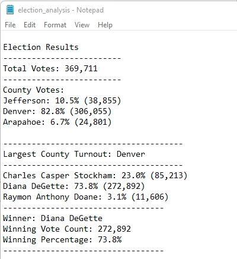
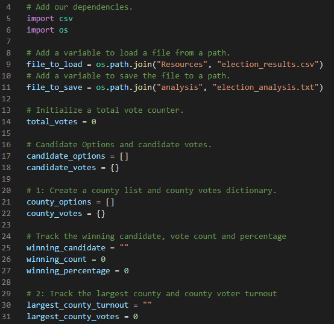
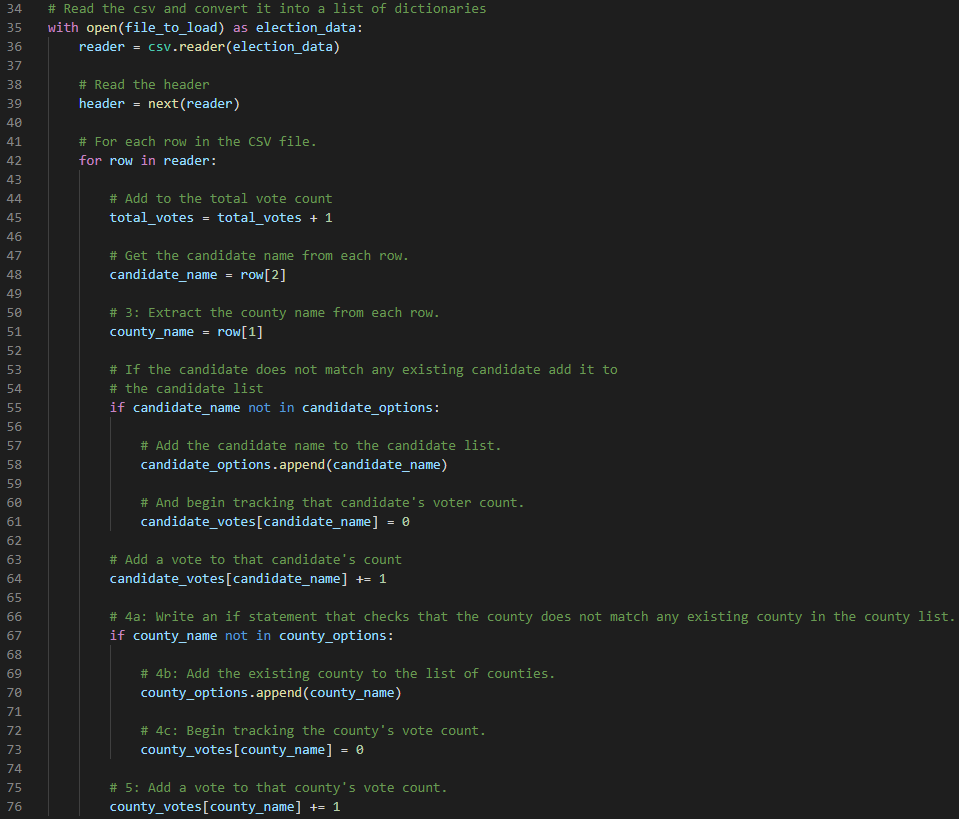
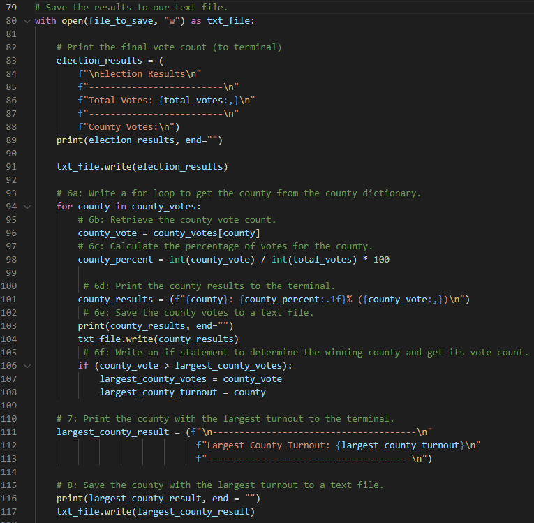
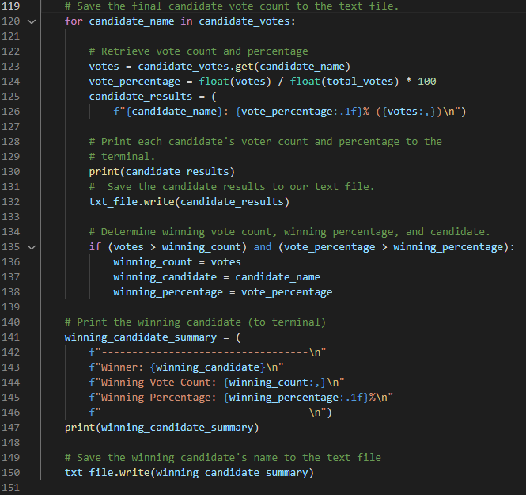

# Election_Analysis

## Overview of Election Audit
Election data from a recent local congressional election was given to me and I performed the election audit. 

## Election-Audit Results

### By performing my audit in Python, I ended up getting the result shown in the screenshot below:

##### 369,711 votes in total were cast in this congressional election.

##### A breakdown of the number of votes and the percentage of total votes for each county in the precinct:
- Jefferson: 10.5% (38,855)
- Denver: 82.8% (306,055)
- Arapahoe: 6.7% (24,801)

##### Denver had the largest number of votes. 

##### A breakdown of the number of votes and the percentage of the total votes each candidate received:
- Charles Casper Stockham: 23.0% (85,213)
- Diana DeGette: 73.8% (272,892)
- Raymon Anthony Doane: 3.1% (11,606)

##### Diana DeGette was the winner of the election! Diana DeGette's vote count was 272,892, which was 73.8% of the total votes.

## Election-Audit Summary

The script looks like it has too many lines and too complicated, but it is actually well-organized with the comments in between the lines 
(describing what the next line will be doing). 
If you can follow through each line with the comments, you will see what I am trying to do easily.
I tried to pull the names of the unique candidates, pull the names of the unique counties, calculate how many votes each candidates got, 
calculate how many votes each county got, and finally pull the result of the election showing which county had the largest vote count and
who won the election. At the end, the summary of the results will be printed in my text file and saved. 

This script can be used with some modification for any election. 
For example, 

## Here is my script!

